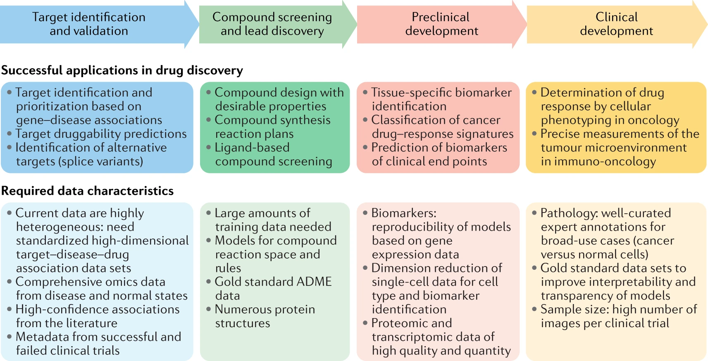

##Outline - AI & Crop improvement
Crop Improvement = Achieving Productivity
- What is Crop Improvement?
  - Historically
    - Conventional breeding
      - hybrid adaptation in 1930s [@Duvick2005]
      - phenotyping + selection
      - phenotyping + genotyping + selection
      - design + phenotyping + genotyping + envirotyping + selection
  - Today
    - Physiological breeding
      - Crop Design
        - Designing plants that optimize cropping systems
        - considers G x E x M(management)
        - Requires: Identifying environmental constraints and designing trait targets
        - Keywords: Enviromics?
      - Genetic Resources
        - ID & Design: Identifying or creating novel sources of genetic variation
        - Keywords: genetic diversity, genome editing, genotyping
      - Phenotyping
        - Captures plant performance data
          - Not necessarily macro-trait of interest (i.e. canopy architecture for yield, rooting for wind resistance, Flowering time for maturity date)
        - Keywords: HTP, Molecular Phenomics, Imaging-based Phenomics, function-valued traits (require parallel enviromics)
      - Genetic analysis
        - Keywords: Genomics
      - Crossing & selection
        - GS (prediction/extrapolation)
          - multi-trait models
        - GxE is only captured if predictions are made considering environmental indexes?
      - Genetic gain evaluation
        - macro-trait improvement (did crop design = increased average yield?)

  - Current Issues
      - "big data" produced to solve previous bottlenecks
        - Rice HTP [@Yang2014]
        - Phenomics Review [@Furbank2011]
        - Image-based phenotyping review [@Fahlgren2015]
        - [Image HTP software 2017](https://www.frontiersin.org/articles/10.3389/fpls.2017.01190/full)
      - simple traits of high heritability have been addressed - need to address/break down complex traits
      - climate change - need to consider environment more
      - effectively applying genome editing

- What is AI?
  - AI
    - Machine learning/Statistical learning
        - Structure:
          - Unsupervised
            - Clustering
            - Association/Dimensionality Reduction
          - Reinforcement
          - Supervised
            - Regression
            - Classification
          - Neural Networks
            - Deep Learning ([Review Nature 2015](https://www.nature.com/articles/nature14539))
- How AI/ML can be used to help address issues

  ML can generate data that is *new, numerous, precise, and/or predicted*
  - Use of AI in Crop improvement
    - Crop Design
      - Goal for right side of the [G x E x M = P] equation and how to get there
    - Genetic Resources (**Population Design**)
      - Optimizing prediction accuracy & cost regardless of ML methods
      - ? genetic diversity ?
    - Phenotyping/**Phenomics**
      - Image analysis
        - CNN
      - Molecular Phenomics
        - ??
    - Genetic analysis/**Genomics**
      - GWAS/QTL
      - Genome sequencing
    - **Enviromics**
    - Crossing & selection (**Genomic Selection**)
      - GS
        - Bayes B, Bayesian LASSO, RR-BLUP, partial least squares regression (PLS), sparse PLS ([GS wheat 2015](https://academic.oup.com/g3journal/article/5/10/1991/6028908))
        - RR-BLUP, BayesA, Bayes Cpi, Baysian LASSO ([GS Loblolly pine 2012](https://pubmed.ncbi.nlm.nih.gov/22271763/))
        - radial basis function neural networks ([GS Example 2012](https://www.ncbi.nlm.nih.gov/pmc/articles/PMC3405257/))
    - ? Genetic gain evaluation

  - Regression
    - rrBLUP
    - GBLUP
    - Bayes A, B, C, Cpi
    - LASSO
    - elastic net
    - Baysian ridge regression
    - Baysian LASSO
    - Reproducing kernels Hilbert spaces regression
    - Random forest
    - Support vector machines
  - Classification
    - Random forest
    - SVM
    - Sparse partial least squares discriminant analysis*
    - Probabilistic neural network
    - Rank*
  - Neural Networks
    - Multilayer perceptron
    - Deep learning
    - Convolutional neural network
    - Multi-trait deep learning
    - Multivariate poisson deep learning
    - probabilistic neural network
    - radial basis function neural network (SVM use radial basis functions?)

things to integrate:
- How can they work together?
  - Current Challenges & AI solutions

    - Higher Precision
      - Ex: disease severity scoring (DL model vs human)
      - GS Prediction
        - achieved through better models, higher quality phenotypes & genotypes
    - More data
      - Automation - Robotics
      - Non-invasive imaging
    - New data
      - Function-value traits
      - Data mining

- Phenomics
  - image-based phenotyping (non destructive)
    - scale: tissue, shoot, root, ground-based, UAV
    - types: 2D, 3D, Far-infrared, hyperspectral
  - Molecular phenomics
    - Gene expression/RNA seq
    - Gene network analysis

  ## Figures

 [ref](https://www.sciencedirect.com/science/article/pii/S1369526616300620)
 [ref](https://www.nature.com/articles/s41573-019-0024-5)

Combine for a new figure
