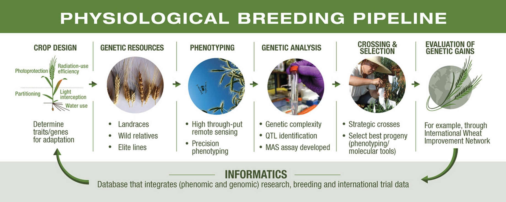
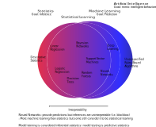

---
title: "AI and Crop Improvement"
author:
- name: Karlene Negus
  affiliation: Iowa State University
  email: knegus@iastate.edu
date: June 2022
abstract: "Lorem ipsum dolor sit amet."
bibliography: "../../Grad_ISU/library.bib"
link-citations: true
link-bibliography: true
geometry: margin = 1in
urlcolor: "red"
toc: true
csl: "./csl/theoretical-and-applied-genetics.csl"
...

<!---
# Example Section

Lorem ipsum dolor sit amet, consectetur adipisicing elit, sed do eiusmod tempor incididunt ut labore et dolore magna aliqua

In-text reference to Fig. {@fig:phybreed1}.

{#fig:phybreed1}

Lorem ipsum dolor sit amet, consectetur adipisicing elit, sed do eiusmod tempor incididunt ut labore et dolore magna aliqua citation [@Duvick2005]. See sec. @sec:example-section
-->
# Crop Improvement

To achieve a rate of yield increase that keeps pace with the growing world population, new approaches to crop improvement will be required.

## Prior Progress

When comparing crop cultivars of a century ago and those of today, considerable differences are often observed. Improvements to yield, plant architecture, and biotic and abiotic resistances, among other traits, have been targeted by breeding and management strategies since the early part of the 20th century. Through the 1930s to 2000s, both breeding and cultural practices contributed considerably to increases in productivity as measured by average yield increases [@Duvick2005; @duvick1999heterosis]. <!--- citations from maize and sorghum only - find other species -->

<!--- phenotyping + selection -->
Conventional breeding took advantage of traditional phenotyping methods to inform crossing and selection.

<!--- phenotyping + selection + genotyping -->
With the increase in genetic technology availability and decrease in cost during the (1980s-2000s), targeted improvements through approaches such as marker assisted selection became feasible. Genetic improvement was seen as the new way forward in contrast to the plateauing gains made from cultural practices. Genetic data became abundant in the next-generation sequencing era. Earlier QTL studies have identified many loci with large contributions to highly heritable traits. Traits with unresolved genetic architecture, result from the contributions of many, small effect loci. QTL studies in such traits require extensive phenotyping and are often not stable across environment.

<!--- phenotyping + selection + genotyping = resulting problems -->
The "phenotyping bottleneck" issue has driven increased research on high throughput phenotyping (HTP) platforms and spurred in the generation of "big data" in many facets of crop improvement schemes.

## Modern Crop Improvement

<!---In recent years focus has returned to approaching crop improvement from all angles. An example of a breeding approach that integrates many different types of data is physiological breeding. Reynolds and Langridge [-@Reynolds2016] break physiological breeding into 6 parts - crops design, genetic resource exploration, phenotyping, genetic analysis, hybridization and progeny selection, and genetic gain evaluation via multi-location testing. This framework helps describe the purpose of obtaining genomic, phenomic and enviromic data during the current breeding cycle and why dissection of traits, genetically and physiologically, is important for -->

<!--- Genomics -->
<!--- Phenomics -->
<!--- Enviromics -->
# AI

In recent years, artificial intelligence (AI) has been increasingly explored as a means to analyze big data. Within crop improvement in the 2020s, the processes of genotyping, phenotyping, and envirotyping a single population can produce dramatically more data then was cumulatively obtained in the breeding process in previous decades. <!--- NGS, phenotyping bottleneck response --> While bottlenecks of traditional methods have been overcome with higher levels of automation achieved with post-NGS sequencing technologies, HTP, and remote sensing, fully exploiting these data in an efficient manor is difficult with prior approaches. AI is most commonly applied through machine learning which includes fields like computer vision, neural networks, deep learning, and others. Certain subfields, like those aforementioned, are more commonly referenced than others in conversations revolving around AI and machine learning. However, there is a great deal of overlap between statistical and machine learning (Fig. {@fig:venndiagram}). <!---Look up real definition--> Any approach that makes a prediction via computation can be condisidered to be machine learning <!--- ... --> For example under this definition, linear models can be considered to be machine learning despite their relative simplicity compared to things like NN and DL.

{#fig:venndiagram}

<!--- redo above -->

Artificial intelligence (AI) is concerned with the process of designing computers that can think and act humanly and rationally [@Russsel2009]. AI algorithms that do not attempt learning are considered to be rules-based. Rules-based systems are generally implemented by defining a series of situation-action (i.e. if-then) rules. Defining these rules requires previous knowledge of the relationship between input-output pairs[@Hayes1985]. Programming a system that can anticipate all situation-actions which lead from input to output variables is more difficult than training a system that can learn from input [@Jordan2015]. At the core of modern AI is machine learning (ML). Machine learning is a subfield within AI which attempts *learning* or improvement through experience [@Libbrecht2015; @Russsel2009; @Liakos2018]. ML can be characterized by feedback type, data type <!--- discrete vs continuous --> ....

Machine learning can be considered to be supervised or unsupervised given the system's access to feedback. Supervised learning occurs in two phases, training and testing. During the training phase, predetermined input-response pairs (labeled data) are used as examples and the learning algorithm attempts to formulate function that connect input data to respective labels [@Liakos2018; @MontesinosLopez2022, p.29]. During the testing phase of supervised learning, the learned pattern (trained model) is used to generate label predictions and the accuracy of the predictions can be evaluated against user-defined labels. In this type of system the feedback is considered to be explicit. In unsupervised learning, the absence of preassigned labels for the input data only allows the model to evaluate patterns and prevents prediction accuracy from being evaluated since no correct input-response pairs have been specified. This type of system has no feedback. Systems that utilize both supervised and unsupervised learning are termed semi-supervised.

Machine learning exists at the intersection of computer science and statistics and thus many statistical models are considered ML when applied with a prediction-centric approach. The field of statistics by comparison puts a greater focus on inference over prediction [@Bzdok2018], but methods shared by the two fields can generally accomplish both. For this reason

## AI in Crop Improvements

Prior issues facing crop improvement research revolved around data accumulation. Genotyping methods prior to NGS were laborious and limited quantities of genotypes were achievable. Traditional phenotyping methods are time intensive and sometimes limited by the expertise of evaluators. Envirotyping was difficult to achieve with useful levels of resolution. Considerable progress has been made on these problems by the early 2020s. The post-NGS sequencing technology era has made sequencing whole genomes a feasible genotyping approach. image-based phenotyping and other high throughput techniques generate terabytes of data every growing season. Remote sensing technologies have made observing envirotypes within a single field possible.**transition** However these solutions lend new issues to the field of crop improvement. New issues revolve around the need for approaches which effectively and efficiently analyzing resulting big data; bridging the gap between observed genotypes and observed phenotypes a) yield results that are meaningful biologically (interpretable), b) feasible computationally (efficient), c) have high fidelity to plants represented (accuracy), d) achieves improvement (predictive/useful). **transition**

Achieving improvement while utilizing genomics, phenomics and enviromics requires an integrative approach. A large number of studies have employed genomic selection for this purpose.

# References
